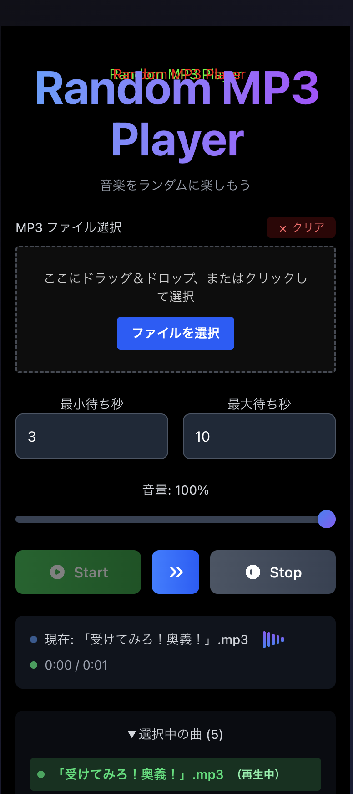

# Random MP3 Player

音楽ファイルをランダムに再生する PWA（Progressive Web App）です。ドラッグ&ドロップで簡単にファイルを追加でき、設定した待機時間でランダムに音楽を楽しめます。

## 📱 スクリーンショット



_Random MP3 Player のメイン画面 - MP3 ファイルのドラッグ&ドロップ、設定調整、ランダム再生機能を提供_

## 🎵 特徴

- **ランダム再生**: 選択した MP3 ファイルをランダムに再生
- **ドラッグ&ドロップ**: 簡単なファイル追加
- **待機時間設定**: 曲間の待機時間をカスタマイズ
- **PWA 対応**: スマートフォンにアプリとしてインストール可能
- **グリッチエフェクト**: 音楽再生時のクールな視覚効果
- **オーディオウェーブ**: 再生中のリアルタイム視覚化
- **スキップ機能**: 現在の曲をスキップして次へ
- **Media Session API**: ロック画面での音楽コントロール対応

## 🚀 技術スタック

- **フロントエンド**: React 18 + TypeScript
- **ビルドツール**: Vite
- **スタイリング**: Tailwind CSS
- **PWA**: Service Worker + Web App Manifest
- **オーディオ**: Web Audio API + HTML5 Audio

## 📱 対応環境

- **デスクトップ**: Chrome, Firefox, Safari, Edge
- **モバイル**: iOS Safari, Android Chrome
- **PWA**: ホーム画面へのインストール対応

## 🛠️ セットアップ

### 前提条件

- Node.js 18 以上
- npm または yarn

### インストール

```bash
# リポジトリをクローン
git clone https://github.com/accuex/sound-app.git
cd sound-app

# 依存関係をインストール
npm install

# 開発サーバーを起動
npm run dev
```

### ビルド

```bash
# 本番用ビルド
npm run build

# ビルド結果をプレビュー
npm run preview
```

## 🎮 使い方

1. **ファイル追加**: MP3 ファイルをドラッグ&ドロップまたは「ファイルを選択」ボタンで追加
2. **設定調整**: 最小・最大待機時間と音量を調整
3. **再生開始**: 「Start」ボタンでランダム再生開始
4. **スキップ**: 再生中に「Skip」ボタンで次の曲へ
5. **停止**: 「Stop」ボタンで再生停止

## 📁 プロジェクト構造

```
src/
├── components/
│   ├── Dropzone.tsx          # ファイルドロップゾーン
│   └── RandomMp3PlayerMobile.tsx  # メインコンポーネント
├── App.tsx                   # アプリケーションエントリーポイント
├── main.tsx                  # React エントリーポイント
└── index.css                 # グローバルスタイル

public/
├── manifest.json             # PWAマニフェスト
├── sw.js                     # Service Worker
├── favicon.ico               # ファビコン
├── icon-192.png              # PWAアイコン（192px）
├── icon-512.png              # PWAアイコン（512px）
└── apple-touch-icon.png      # Apple Touch Icon（180px）
```

## 🎨 カスタマイズ

### カラーテーマ

`src/index.css` でカラーパレットを変更できます：

```css
:root {
  --primary-color: #3b82f6;
  --secondary-color: #8b5cf6;
  --background-gradient: linear-gradient(
    135deg,
    #0a0a0a 0%,
    #1a1a2e 50%,
    #16213e 100%
  );
}
```

### グリッチエフェクト

`src/index.css` の `.glitch-effect` クラスでエフェクトを調整：

```css
.glitch-effect {
  animation: glitch 0.3s infinite; /* 速度調整 */
}
```

## 🔧 開発

### 利用可能なスクリプト

```bash
npm run dev          # 開発サーバー起動
npm run build        # 本番ビルド
npm run preview      # ビルド結果プレビュー
npm run lint         # ESLint実行
npm run lint:fix     # ESLint自動修正
```

### コード品質

- **ESLint**: コード品質チェック
- **TypeScript**: 型安全性
- **Prettier**: コードフォーマット

## 📦 PWA 機能

### Service Worker

- オフライン対応
- アセットキャッシュ
- バックグラウンド同期

### Web App Manifest

- アプリ名: "Random MP3 Player"
- ショート名: "RandomMP3"
- テーマカラー: #111111
- アイコン: 192px, 512px, Apple Touch Icon

## 🐛 トラブルシューティング

### よくある問題

1. **ファイルが再生されない**

   - ブラウザの自動再生ポリシーを確認
   - ユーザー操作後に再生を開始

2. **PWA がインストールできない**

   - HTTPS 環境で動作しているか確認
   - Service Worker が正しく登録されているか確認

3. **iOS で動作しない**
   - Safari の最新版を使用
   - `playsinline` 属性が設定されているか確認

## 🤝 コントリビューション

1. このリポジトリをフォーク
2. フィーチャーブランチを作成 (`git checkout -b feature/amazing-feature`)
3. 変更をコミット (`git commit -m 'Add amazing feature'`)
4. ブランチにプッシュ (`git push origin feature/amazing-feature`)
5. プルリクエストを作成

## 📄 ライセンス

このプロジェクトは MIT ライセンスの下で公開されています。詳細は [LICENSE](LICENSE) ファイルを参照してください。

## 🙏 謝辞

- [React](https://reactjs.org/) - UI ライブラリ
- [Vite](https://vitejs.dev/) - ビルドツール
- [Tailwind CSS](https://tailwindcss.com/) - CSS フレームワーク
- [Web Audio API](https://developer.mozilla.org/en-US/docs/Web/API/Web_Audio_API) - オーディオ処理

## 📞 サポート

問題や質問がある場合は、[Issues](https://github.com/your-username/sound-app/issues) で報告してください。

---

**Random MP3 Player** - 音楽をランダムに楽しもう 🎵
